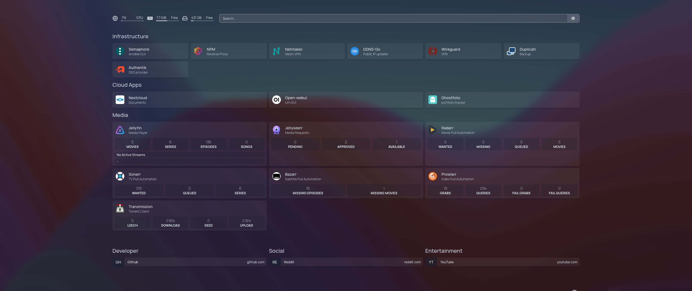

# Self-hosted

Self-hosted is a collection of Ansible playbooks designed to deploy and update your self-hosted applications. While it can be used directly with Ansible, it was specifically created with [Semaphore](https://semaphoreui.com/) in mind to provide a more user-friendly experience.

current look of homepage dashboard if using the shipped configuration files (variable have to be set)

- **Note** The following instructions are designed for Debian-based servers (such as Debian, Ubuntu, Armbian, etc.). If you need to adjust or modify the settings, feel free to fork the repository and customize it to your requirements. If there are apps you'd like to see added, please open an issue!

## How To

- **OPTIONAL**:Install [Netmaker](https://www.netmaker.io/) to create a mesh VPN between hosts on different networks, allowing them to securely connect and communicate.
    - Install NetClient on the hosts you want to designate as nodes
    - Add Egress Rules to be allow communication between networks
    - Add Gateway to connect devices as clients. **(Note)**: you might need to design a custom DNS for it to work proprely.

- **RECOMMENDED** Install [Semaphore](https://semaphoreui.com/) a web-based interface for managing Ansible automation tasks. It provides a user-friendly, intuitive platform to run, monitor, and manage Ansible playbooks, making automation accessible even for those with limited command-line experience.

    - Set Repository
    - Set credentials in the **Key Store** (github if needed, hosts credentials)
    - Set inventory (hosts you want to target)
    - Set Variable Groups (list of variables to set in env-library)
    - Create  Tasks
    - Schedule updates tasks
    
# Playbooks

- **Gateway Apps**

    - Redis + Postgres
    - [Authentik](https://goauthentik.io/): SSO Provider
    - [Nginx-Proxy-Manager](https://nginxproxymanager.com/): Reverse Proxy (To be added)
    - [wg-easy](https://github.com/wg-easy/wg-easy): Wireguard VPN + GUI (alternative to Netmaker client)
    - [DDNS-go](https://github.com/jeessy2/ddns-go) Public IP updater (To be added)

- **Cloud Apps**

    - Redis + Postgres
    - [Open-webui](https://docs.openwebui.com/): GUI for llm's (open-AI api, ollama)
    - [Nextcloud](https://nextcloud.com/): self-hosted alternative to drives (dropbox, google, etc..)
    - [Only-office](https://www.onlyoffice.com/): Documents server version to integrate with Nextcloud
    - [Duplicati](https://duplicati.com/): Backup solution.
    - [Ghostfolio](https://ghostfol.io): Portfolio tracker
    - [Homepage](https://gethomepage.dev/): dashboard for your homeserver.

- **Media Center**
    - [Jellyfin](https://jellyfin.org/): Media Player 
    - [Jellyseer](https://github.com/Fallenbagel/jellyseerr): Media request automation
    - [Prowlarr](https://prowlarr.com/): indexer manager
    - [radarr](https://radarr.video/): movie collection manager
    - [sonarr](https://sonarr.tv/): TV Shows collection manager
    - [Bazarr](https://www.bazarr.media/) Subtitle manager
    - [Transmission](https://transmissionbt.com/) Torrent Client

